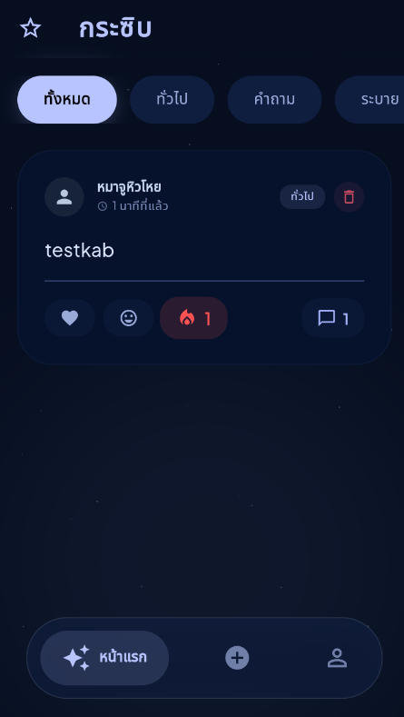

# 🌌 Krasib (กระซิบ)
> **"พื้นที่ปลอดภัยสำหรับความลับของคุณ ในค่ำคืนที่เงียบสงัด"**

**Krasib** คือแอปพลิเคชัน Social Media แนว Anonymous (ไม่ระบุตัวตน) ที่ถูกออกแบบมาด้วยแนวคิด **Glassmorphism** และ **Bento Box Design** มุ่งเน้นความเรียบง่ายแต่หรูหรา พร้อมระบบ Realtime ที่สมบูรณ์แบบ

---

## 📸 Screenshots

| หน้าฟีดหลัก | สร้างข้อความกระซิบ | โปรไฟล์ผู้เยี่ยมชม |
| :---: | :---: | :---: |
|  |  |  |

---

## ✨ คุณสมบัติเด่น (Key Features)

* **🎭 Anonymous Identity:** ระบบสุ่มตัวตนภาษาไทยสุดน่ารัก (เช่น หมาจูหิวโหย, สลอธขี้เซา) โดยใช้ระบบ Guest ID ไม่ต้องสมัครสมาชิกให้วุ่นวาย
* **📡 Realtime Communication:** รับส่งข้อมูลโพสต์และคอมเมนต์แบบทันที (Powered by Supabase Realtime) โดยไม่ต้องดึงข้อมูลใหม่
* **💎 Glassmorphism UI:** ดีไซน์หน้าจอแบบกระจกโปร่งแสง (Frosted Glass) ให้ความรู้สึกพรีเมียมและทันสมัย
* **🔥 Interactive Reactions:** แสดงความรู้สึกต่อโพสต์ด้วย Emoji Animations พร้อมระบบนับยอดไลค์แบบ Realtime
* **🌑 Night-Sky Aesthetic:** คุมโทนแอปด้วยสี Deep Navy และ Effect แสงฟุ้งที่ถนอมสายตาและดูน่าค้นหา
* **🔒 Privacy First:** ระบบล้างข้อมูลตัวตน (Reset Identity) เพื่อสุ่มชื่อใหม่และลบประวัติในเครื่องได้ทันที

---

## 🛠️ เทคโนโลยีที่ใช้ (Tech Stack)

* **Frontend:** [Flutter](https://flutter.dev/) (Dart)
* **Backend:** [Supabase](https://supabase.com/) (PostgreSQL & Realtime Engine)
* **State Management:** StreamBuilder & Stateful Widgets
* **Local Storage:** SharedPreferences (สำหรับเก็บ Guest Session)
* **Design Pattern:** Component-Based UI (Bento Layout)

---

## 🚀 วิธีการติดตั้ง (Getting Started)

1.  **Clone Project:**
    ```bash
    git clone [https://github.com/your-username/krasib.git](https://github.com/bankneedtosleep/krasib_app.git)
    ```
2.  **Install Dependencies:**
    ```bash
    flutter pub get
    ```
3.  **Environment Setup:**
    สร้างไฟล์สำหรับเก็บ API Key ของ Supabase (หรือใส่ในโค้ดตามโครงสร้างปัจจุบัน):
    * `SUPABASE_URL`
    * `SUPABASE_ANON_KEY`
4.  **Run Application:**
    ```bash
    flutter run
    ```

---

## 👨‍💻 Developer
**Created with ❤️ by bankneedtosleep**
*หากคุณชอบโปรเจ็กต์นี้ อย่าลืมกด ⭐ ให้กับ Repository นี้ด้วยนะครับ!*